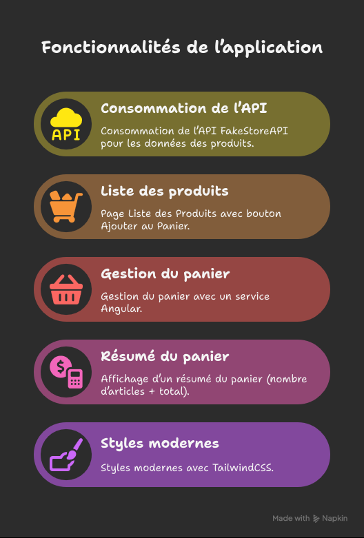
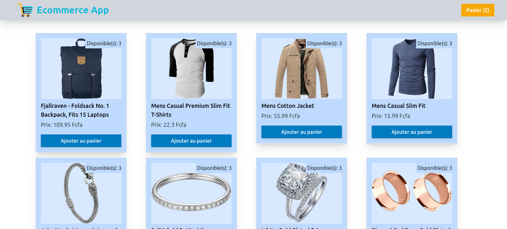
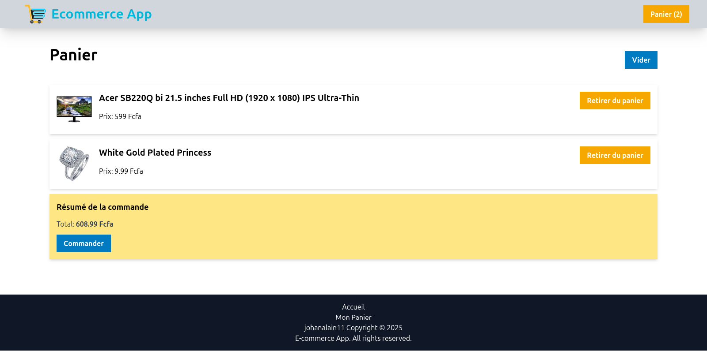

# ✅ Projet Ecommerce App (Angular + TailwindCSS)

     

---

## 📖 Description
**Ecommerce App** est une application construite avec **Angular** et **TailwindCSS**.  
Elle permet de :
- Récupérer et afficher une liste de produits depuis l’API publique **FakeStoreAPI**,
- Ajouter des produits au panier,
- Accéder à une page **Panier** avec la liste des articles sélectionnés,
- Générer un **résumé du panier** (quantité totale et prix total). 

---

## 🚀 Fonctionnalités



#### ✅ Consommation de l’API [FakeStoreAPI](https://fakestoreapi.com/products)  
#### ✅ Page **Liste des Produits** avec bouton *Ajouter au Panier*
#### ✅ Gestion du **panier** avec un **service Angular**  
#### ✅ Affichage d’un **résumé du panier** (nombre d’articles + total)  
#### ✅ Styles modernes avec **TailwindCSS** 

---

## 🛠️ Technologies utilisées
- 🅰️ **Angular** - Framework principal
- 🎨 **TailwindCSS** - Système de styles utilitaire
- 🟦 **TypeScript** - Langage utilisé pour Angular
- 🌐 **FakeStoreAPI** - Source de données pour les produits 
- ⚡ **Node.js (22)** — Environnement 

---

## 📦 Installation et Utilisation

### 1️⃣ Cloner le projet
```sh
git clone https://github.com/ton-profil/todoapp.git
cd ecommerce-app

```

### 2️⃣ Installer les dépendances
```sh
npm install
```

### 3️⃣ Lancer l’application Angular
```sh
ng serve
```

➡️ Ouvrir dans le navigateur 👉 [http://localhost:4200](http://localhost:4200)

## 📂 Structure du projet
```bash
/todoapp
├── /src
│   ├── /app
│   │   ├── /components # Dossier des composants
│   │   ├── /models     # Dossier des modèles: définition de la structure d'un produit
│   │   ├── /pages      # Dossier des pages du site
│   │   ├── /services   # Dossier des services
│   │   ├── app.config.ts
│   │   ├── app.css
│   │   ├── app.html
│   │   ├── app.routes.ts
│   │   ├── app.spec.ts
│   │   └── app.ts
│   ├── index.html
│   ├── main.ts
│   └── styles.css
├── .postcssrc.json
├── angular.json
├── package.json
├── README.md
├── tsconfig.app.json
├── tsconfig.json
└── tsconfig.spec.json
```

---

## 🎨 Aperçu de l'Interface
- Page de Produits


- Page du panier


---

## 📊 Exemple d’Utilisation

1. L’application récupère la liste des produits depuis https://fakestoreapi.com/products
2. L’utilisateur ajoute un produit au panier
3. Il est redirigé vers la page Panier
4. La page Panier affiche :
  - ✅ Liste des articles sélectionnés
  - ✅ Quantité totale
  - ✅ Prix total

----------

## 🔮 Améliorations Futures

> [!NOTE]
> 
> -   Améliorer la gestion du panier en définissant ses éléments indépendament des id de produit
> -   Ajouter une authentification (connexion/inscription)
> -   Gérer le paiement (simulation Stripe ou PayPal)
> -   Filtrer et trier les produits (prix, catégorie, popularité)
> -   Déployer une version en ligne (Netlify / Vercel + API hébergée)
> -   Améliorer le design avec des composants plus dynamiques (animations, toasts, etc.)
>     
----------

## Auteur
**Johan Alain**

[GitHub](https://github.com/johanalain11/)

## 📜 Licence

Ce projet est sous licence MIT.

----------

✨ **N’hésite pas à contribuer !**  
💡 **Suggestions et retours sont les bienvenus !** 😊  
📩 **Contact :** [LinkedIn](www.linkedin.com/in/johanalain11) | Email [jank092016@gmail.com](mailto:jank092016@gmail.com)
